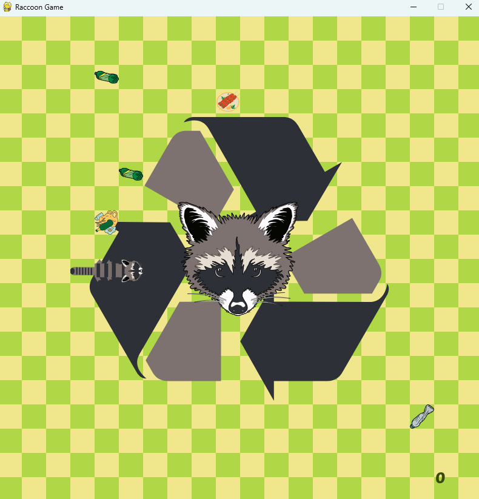

# Raccoon Game

## Overview

In **Raccoon Game**, you play as a raccoon on an exciting adventure to escape from trash while trying to reach the delicious shish kebab. The game features fast-paced action where the raccoon must avoid obstacles and dodge trash to achieve its ultimate goal.

## How to Play

- **Objective:** Help the raccoon avoid trash and reach the tasty shish kebab.
- **Controls:** Use the keyboard or mouse to control the raccoon and navigate through the obstacles.

## Features

- Engaging gameplay with obstacles and challenges.
- Fun and colorful graphics.
- Exciting race to escape the trash and grab the kebab.

## How to Run the Game

To run the game, follow these steps:

### 1. **Download and Extract**

Make sure to download the entire **dist** folder, which includes all the necessary files for the game to run. The folder structure should look like this:

dist/ ├── raccoon.exe ├── Font/ ├── Graphics/ ├── Sound/ └── raccoon.spec

### 2. **Run the Game**

- Go to the **dist** folder.
- Double-click on **`raccoon.exe`** to launch the game.
- Ensure that the **Font**, **Graphics**, and **Sound** folders are in the same folder as the `.exe` file, as these are required for the game to function correctly.

### 3. **What If I Get an Error?**

If you encounter an error, it may be due to missing files. Please ensure the following:

- All necessary files are in the **dist** folder.
- The **Font**, **Graphics**, and **Sound** folders must be in the same directory as the **`raccoon.exe`** file.

If any files are missing, the game might not run properly.

---

Enjoy the game and try to help the raccoon avoid the trash and reach the delicious shish kebab!
